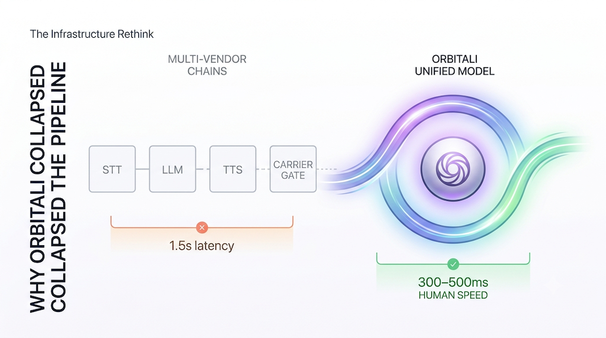

# Introducing Orbitali: Why We Traded the Voice AI Pipeline for a Single Real-Time Model



Most AI voice receptionists give you a "hello? ... hello?"

You know the feeling. You call a business, an automated voice answers, and you state your request. Then... *nothing*. An awkward, 1.5-second silence hangs over the line. You wonder if the call dropped. You open your mouth to say "hello?" again, right as the AI finally begins to speak, resulting in an uncomfortable, robotic conversational collision. 

This 1.5-second lag isn't just annoying; it is a conversion killer. In human-to-human conversations, the natural response window is tight: between 200ms and 400ms. Once an agent takes longer than 600ms to reply, the human brain registers a jarring gap. When it creeps past 900ms, the conversation completely breaks down.

Today, we are launching **Orbitali into public developer beta** to permanently solve this problem. 

Orbitali is a real-time AI voice agent infrastructure layer that lets developers build, deploy, operate, and observe conversational voice agents that hit natural human response times of **300–500ms**. We achieved this not by tweaking old code, but by completely throwing out the traditional multi-vendor architecture that dominates the industry. 

Here is an honest look behind the scenes at why the traditional voice AI pipeline is fundamentally broken for real-time applications, how we built a better runtime layer, and the deliberate engineering trade-offs we made to achieve true conversation at scale.

---

## The Flawed Architecture of the Traditional Voice AI Pipeline

To understand why your current voice bot feels like a sluggish phone tree, you have to look at the underlying infrastructure. Almost every major voice orchestration platform on the market today acts as a "pipeline wrangler". They chain together three completely separate systems from three different vendors to accomplish a single turn of conversation:

$$	ext{Speech-to-Text (STT)} \longrightarrow 	ext{Large Language Model (LLM)} \longrightarrow 	ext{Text-to-Speech (TTS)}$$

Every single time a user speaks over the phone or browser, the traditional architecture executes the following network hops:

1. **The Transcription Leg (STT):** The incoming audio stream is captured, packetized, and sent to a third-party speech-to-text API (like Deepgram or AssemblyAI). The model must wait until a sufficient phrase or complete sentence is spoken to output a clean text string.
2. **The Reasoning Leg (LLM):** The text transcript is sent over the network to a language model provider (like OpenAI or Anthropic). The LLM processes the text, computes the response, and begins streaming text tokens back.
3. **The Synthesis Leg (TTS):** The generated text tokens are fed into a text-to-speech engine (like ElevenLabs or Cartesia) to be converted back into audio waveforms.
4. **The Delivery Leg:** The compiled audio stream is finally packaged and piped back into the carrier's telephony gateway to reach the user's ear.

### The Latency Tax: Why Pipelines Fail
Even if you optimize every single leg of this pipeline, you are fighting against the basic laws of networking and compute. Each handoff between distinct API vendors introduces **inter-service network latency**. 

Furthermore, you pay a cumulative processing delay penalty. If your STT takes 200ms, your LLM takes 400ms to generate the core response context, and your TTS takes another 300ms to synthesize the emotional nuance of the audio, your baseline latency is already at 900ms. Add in network packet routing across disparate cloud data centers, and you land square in the uncomfortable 1.5-second "robotic silence" territory.

No amount of engineering cleverness can bypass this structural reality. When you build an architecture based on three stacked markups and three separate API relationships, you are optimizing for component variety at the direct expense of the end-user experience.

---

## The Infrastructure Rethink: Single-Pass Speech-to-Speech

At Orbitali, we built our runtime with a single guiding thesis: **latency is the feature**. If an AI voice receptionist can't respond fast enough to feel human, nothing else it does matters.

To hit our target response times of 300–500ms, we collapsed the traditional multi-vendor pipeline entirely. Orbitali operates on a single, unified, real-time **speech-to-speech** model architecture. 

```
[User Audio Stream] ──(Direct Network Connection)──> [Orbitali Orchestration Service]
                                                               │
                                                 (Single Native Model Pass)
                                                               │
                                                               ▼
[Carrier Stream] <───(300-500ms Response)─────────── [Real-Time Speech-to-Speech Model]
```

Under the hood, we leverage a state-of-the-art, unified real-time speech-to-speech model. 

Instead of treating audio transcription, textual reasoning, and audio synthesis as sequential tasks, our voice model handles all three natively inside a single model layer in one pass. There is no audio-to-text translation step that loses tone or cadence, and no text-to-speech synthesis step that adds latency. The raw audio bytes stream directly into the model, and streaming audio bytes come directly out, starting before the complete response is even finished computing.

By running our stateless orchestration infrastructure in optimized regions close to major carrier networks, we minimize network hops to the millisecond. We completely bypass the inter-service network chaos. Orbitali acts strictly as a highly optimized real-time orchestrator, feeding the speech model context and executing developer business logic seamlessly.

---

## The Intentional Trade-Off: Performance Over Personalization

We know what some enterprise developers will ask: *"Can I swap out the underlying model for my own fine-tuned open-source LLM? Can I plug in a custom voice vendor I like?"*

Our answer is direct: **No.** And that is an explicit, intentional constraint, not an oversight.

We deliberately traded à-la-carte vendor swapping for an agent that actually feels like a living human on the other end of the line. Platforms that allow total customization force you to manage immense integration complexity and accept the performance degradation of the multi-provider pipeline. 

By standardizing on a single, highly performant model architecture, we deliver several massive advantages to engineering teams:

* **Operational Simplicity:** You don't need to juggle three separate subscription keys, monitor uptime across multiple infrastructure platforms, or worry about a voice-synthesis API update breaking your prompt formatting. One platform handles it all.
* **True Bidirectional Streaming & Barge-In:** Because the voice model is natively aware of incoming audio parameters, it handles natural user interruptions instantly. If the AI agent is speaking and a caller interrupts with *"Wait, let me change that time,"* Orbitali detects the incoming audio stream, immediately cuts off the outgoing speech generation, and re-focuses on the client's words. It mirrors natural human phone behavior.
* **Zero-Markup Transparent Pricing:** Because we don't have three stacked markups to pass along, we offer a flat, transparent runtime fee of **€0.10/minute** (metered in precise 10-second increments) across all of our plans, pulling from your baseline monthly allowance.

---

## Clean Separation of Concerns: You Own the Logic, We Run the Agent

While we restrict model configuration to preserve latency, we provide absolute flexibility regarding your application data. Orbitali maintains a strict separation of concerns: your customer records, custom rules, and backend data stay entirely within your infrastructure. 

```
┌─────────────────────────────────┐                 ┌───────────────────────────┐
│        ORBITALI RUNTIME         │                 │     DEVELOPER BACKEND     │
│  - Low-Latency Voice Streaming  │  agent:tool-call │  - Customer CRMs / APIs   │
│  - Speech-to-Speech Model       │ ────────────────> │  - Booking / Availability │
│  - Native Vector RAG Engine     │ <──────────────── │  - Proprietary Logic      │
│                                 │   JSON Response   │                           │
└─────────────────────────────────┘                 └───────────────────────────┘
```

When you build an agent on Orbitali, you can leverage advanced developer primitives via webhooks:

### 1. Dynamic Prompts (Before the Call)
Static instructions can limit an AI's utility. With Orbitali, you can configure your agent with a `Server URL` webhook. The millisecond an incoming call hits your phone line, Orbitali pings your backend server with an `agent:assistant-request` payload containing the caller's metadata. Your backend can instantly look up that number in your CRM and return a completely dynamic, personalized greeting or instruction string:

> *"Hello Alex, welcome back to your Platinum account tier. I see your flight was delayed..."*

### 2. Live API Tools (Mid-Conversation)
Voice agents should execute tasks, not just converse. Orbitali supports custom Developer Tools defined via simple JSON Schema parameters. When the conversation triggers an action—like booking a clinic appointment or checking an order status—Orbitali pauses audio generation and posts an `agent:tool-call` webhook event to your server. Your server runs the local business logic, returns a standard JSON payload, and the agent continues speaking smoothly.

### 3. Native Zero-Config RAG
If you have massive product sheets, complex internal policies, or extensive FAQs, you don't need to jam them into a system prompt or build a slow external search API. You can upload Markdown or PDF documents directly to the Orbitali dashboard. Our platform automatically chunks and embeds your data into a high-performance vector database. When the agent needs information, it runs an optimized semantic similarity search tool (`search_knowledge`) internally, bringing back hyper-relevant answers with zero added latency.

---

## Built for Builders: Bring Your Own Carrier (BYOC)

Orbitali is infrastructure for developers, product teams, and automation agencies who want to deploy production-grade voice bots for inbound workflows like front-desk reception, intake routing, customer service triage, or booking lines. 

Because we focus exclusively on building the absolute best real-time runtime layer, **we are not a phone carrier**. We do not sell phone numbers, and we do not mark up your telephony costs by 300%. 

We operate on a strict **Bring Your Own Carrier (BYOC)** framework. You link your own existing Twilio or Telnyx accounts directly to Orbitali via standard OAuth or webhooks. You keep your bulk carrier pricing, protect your data compliance posture, and maintain full ownership over your phone numbers. You pay your carrier directly for the line routing, and you pay Orbitali solely for the AI runtime minutes.

*Note: Orbitali is purpose-built and highly optimized for inbound call handling workflows. We do not support mass outbound robocalling, automated telemarketing dialers, or spam campaigns. This design choice keeps our infrastructure clear of spam traffic and lets us focus on providing top-tier service to legitimate development teams.*

---

## Join the Public Developer Beta Today

The era of the awkward voice AI silence is over. By abandoning the broken multi-vendor pipeline and engineering a platform around a single, unified real-time speech-to-speech model, we have unlocked human-grade responsiveness for voice applications.

Our public developer beta is officially live. Every new account receives **5 free trial minutes** (valid for 7 days, no credit card required) to test the latency improvements firsthand. From there, you can scale seamlessly into production across our flexible subscription tiers:

| Plan | Base Price / mo | Included Minutes | Overage Rate | Best For |
| :--- | :--- | :--- | :--- | :--- |
| **Launch** | €49 | 300 | €0.10 / min | Validating initial customer MVPs |
| **Studio** | €199 | 1,500 | €0.10 / min | Production scaling & deep reporting |
| **Agency** | €499 | 5,000 | €0.10 / min | Unlimited active agents & concurrent lines |

Ready to build a voice agent that actually sounds human?

* **Get Started Immediately:** Sign up and access the dashboard at [app.orbitali.ai](https://app.orbitali.ai).
* **Review the Architecture:** Dive deep into webhooks, dynamic prompts, and tool schemas via our comprehensive developer docs.
* **Connect with the Founders:** Have a highly customized scale requirement or agency deployment? Book a direct engineering discovery session through our dashboard calendar link.
