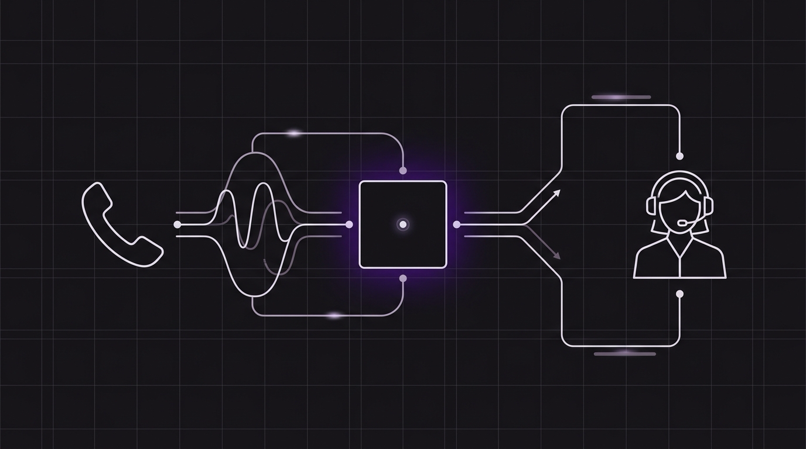

# Diseñando conversaciones: 3 reglas para crear asistentes de voz con los que a los clientes les encante hablar



Escribir instrucciones para un agente de voz es completamente diferente a redactar textos para un widget de chat. Si tu bot de voz habla en párrafos largos, los usuarios se aburrirán, perderán el hilo de los detalles o simplemente interrumpirán al bot a mitad de frase.

En una interfaz de chat basada en texto, los usuarios pueden leer los párrafos a su propio ritmo. Pueden releer frases, ignorar palabras de relleno y aislar visualmente el llamado a la acción. La voz, sin embargo, es lineal y efímera. Cuando un cliente llama a tu negocio, se encuentra inmerso en un flujo auditivo en tiempo real. Cada segundo que tu asistente pasa hablando es un segundo que el interlocutor debe dedicar a escuchar activamente, memorizar y esperar su turno para responder.

Para construir agentes de voz que resulten naturales y agradables, debes cambiar tu mentalidad de "redacción de contenidos" a "diseño de conversaciones". En este artículo, abordaremos tres reglas esenciales para diseñar prompts de asistentes de voz que fomenten la interacción y aumenten la satisfacción del cliente (CSAT) utilizando las primitivas conversacionales de Orbitali.

---

## Regla 1: Mantén la brevedad (La restricción de 1 a 2 frases)

El error número uno que cometen los desarrolladores al implementar su primera IA de voz es tratar la respuesta del prompt como si fuera un correo electrónico o una página de preguntas frecuentes. Si tu agente responde con cuatro o cinco frases a la vez, es muy probable que el interlocutor experimente una sobrecarga cognitiva.

En el diseño de voz, la regla de oro es simple: **las respuestas deben limitarse a una o dos frases.**

Al mantener las respuestas cortas, creas un ritmo dinámico de toma de turnos. Esto imita la forma en que los humanos conversan de manera natural por teléfono. En lugar de ofrecer toda la información de golpe, tu agente de voz debería presentar un pequeño fragmento de información y ceder inmediatamente el turno al interlocutor con una pregunta aclaratoria.

### El contraste

* **❌ Enfoque de chat (Demasiado largo):** *"Hola, gracias por llamar a Acme Dental. Hemos estado sirviendo a la comunidad local por más de quince años. Puedo ayudarle a programar una nueva cita, verificar los detalles de su cobertura de seguro o responder a cualquier consulta de facturación. Para comenzar, ¿podría proporcionarme su nombre completo y fecha de nacimiento, o indicarme si es un paciente que regresa?"*
* **Enfoque de voz (Breve y claro):** *"Gracias por llamar a Acme Dental. Puedo ayudarte a programar una cita, verificar tu seguro o responder preguntas de facturación. ¿Qué puedo hacer por ti hoy?"*

Al configurar las instrucciones dinámicas de tu agente a través de la carga útil del webhook `agent:assistant-request`, incluye siempre restricciones explícitas sobre la longitud de las frases:

```json
{
  "prompt": "You are a front-desk receptionist. Help the customer schedule an appointment. CRITICAL: Keep every response to 1-2 sentences maximum. Never output paragraphs. Ask clarifying questions to guide the user step-by-step."
}
```

---

## Regla 2: Habla como un humano (Transiciones conversacionales)

Una conversación debe fluir, no sentirse como una interfaz de línea de comandos. Los sistemas tradicionales de IVR (Respuesta de Voz Interactiva) obligaban a los usuarios a escuchar menús rígidos (*"Para ventas, presione 1..."*). Al construir agentes de voz con IA, los desarrolladores a veces recurren a este patrón, haciendo que el bot formule preguntas robóticas y binarias.

Para que un asistente se sienta natural, indícale que use **marcadores conversacionales** (por ejemplo, *"Entendido"*, *"De acuerdo"*, *"Claro que sí"*, *"Permítame verificar eso..."*) al comienzo de sus turnos.

Estas pequeñas palabras cumplen dos funciones principales:
1. **Retroalimentación auditiva:** Le aseguran al interlocutor que la IA ha escuchado y comprendido su declaración anterior.
2. **Mitigación de la latencia:** Recuperar datos de una base de datos mediante webhooks o ejecutar una consulta semántica tarda uno o dos segundos. Al decir *"Claro que sí, déjeme buscar los detalles de su cuenta..."* antes de activar una herramienta, el agente mantiene al usuario atento durante el breve periodo de procesamiento.

### Indicando las transiciones en el Prompt

Al escribir las instrucciones de tu agente, define explícitamente cómo debe reconocer las entradas del usuario:

* **Estilo de prompt robótico:** *"Cuando el usuario te dé su número de cuenta, llama a la herramienta de búsqueda de inmediato."*
* **Estilo de prompt conversacional:** *"Cuando el usuario comparta su número de cuenta, confírmalo de inmediato con una frase natural como 'Entendido, déjeme abrir su cuenta' o 'Claro, déjeme verificar eso por usted', y luego ejecuta la herramienta de búsqueda."*

Este pequeño ajuste elimina los silencios incómodos y hace que la interacción se sienta más como una colaboración que como un interrogatorio.

---

## Regla 3: Gestiona la transferencia (Transiciones fluidas a humanos)

Ningún agente de voz puede resolver el 100% de los problemas de los clientes. Es posible que un usuario tenga un caso límite muy específico, solicite hablar con un supervisor o simplemente muestre frustración. La marca de una experiencia de voz premium no es si puede manejar cada escenario, sino **qué tan elegantemente gestiona el fallo**.

Cuando un agente alcanza sus límites, debe transferir al interlocutor a un recepcionista humano sin fricciones.

Orbitali facilita esto al exponer la herramienta de sistema nativa `transfer_call`. Si se configura un destino de transferencia válido para tu número de teléfono, el agente puede invocar `transfer_call` dinámicamente cuando se cumplan ciertos criterios.

### Estructurando la transferencia en las instrucciones

Para implementar una transferencia limpia, debes indicarle al agente *cuándo* transferir y *cómo* anunciar la transición:

1. **Identifica el activador:** Entrena al agente para reconocer la frustración (por ejemplo, tonos de voz elevados, peticiones repetitivas) o temas complejos fuera de su alcance (por ejemplo, disputas legales, ajustes de facturación detallados).
2. **Anuncia la transferencia:** El agente nunca debe transferir una llamada en silencio. Debe explicar qué está sucediendo para que el interlocutor no piense que la llamada se ha cortado.
3. **Ejecuta la herramienta:** Invoca la herramienta `transfer_call`.

A continuación, se muestra un ejemplo de estructura de prompt para gestionar transferencias:

```markdown
- **Temas fuera de alcance:** Si el interlocutor pregunta por ajustes de facturación personalizados o solicita hablar con un gerente, debes transferirlo.
- **Protocolo de transferencia:**
  1. Di: "Con gusto le comunicará con un compañero para que le ayude con eso. Permítame transferirle a nuestra recepción ahora mismo."
  2. Ejecuta inmediatamente la herramienta de sistema `transfer_call`.
```

Al presentar una vía clara y de apoyo hacia un humano, generas confianza, incluso cuando la IA no puede resolver el problema por sí misma.

---

## Bajo riesgo, alto impacto: Por qué la optimización de prompts es segura

Los desarrolladores suelen ser cautelosos a la hora de actualizar funciones de IA en producción debido a los riesgos de regresión de código, errores en la base de datos o configuraciones de seguridad incorrectas.

Sin embargo, optimizar el diseño de la conversación y la estrategia de prompts de tu asistente de voz es **completamente seguro**.

Dado que estas instrucciones residen en la capa de prompts (ya sea de forma estática en la configuración de tu agente o devueltas dinámicamente a través del servidor del webhook `agent:assistant-request`), no modifican el código de tu base de datos ni tus credenciales de seguridad. Ajustar los prompts para imponer la brevedad, incluir marcadores conversacionales o refinar los umbrales de transferencia no requiere cambios arquitectónicos. Esto lo convierte en la forma más efectiva y de menor riesgo para mejorar la satisfacción del cliente y reducir el abandono de llamadas.

*¿Listo para diseñar tu primera conversación? [Lee nuestra Guía de Ingeniería de Prompts](https://docs.orbitali.ai/prompts) o [regístrate para obtener una cuenta de desarrollador en Orbitali](https://orbitali.ai/signup) para probar tus prompts en vivo en el simulador de navegador.*
