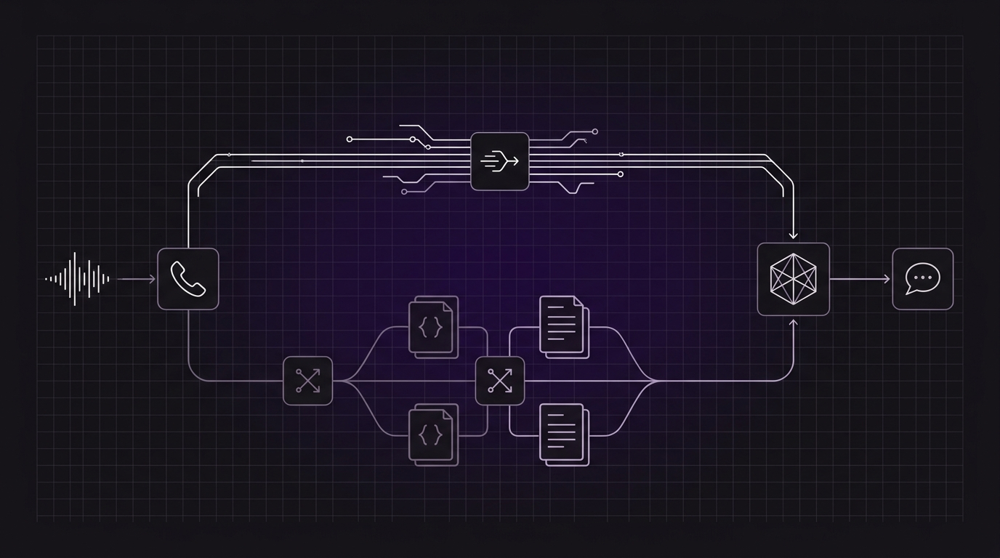

# Inyección dinámica de contexto: diseñando RAG por voz de ultra-baja latencia



En las búsquedas web o en los chats de texto, un retraso de 1 segundo en una consulta a una base de datos vectorial es algo completamente normal. El usuario escribe una instrucción en ChatGPT o en una barra de búsqueda, observa un indicador de escritura animado o puntos parpadeantes durante 1.200 milisegundos y lee la respuesta sin ninguna frustración.

En una llamada telefónica, ese mismo retraso de 1 segundo es una eternidad.

Las investigaciones en lingüística conversacional demuestran que la toma de turnos natural entre humanos opera en un margen diminuto de aproximadamente **200 milisegundos**. Cuando una pausa incómoda supera los 600 ms, la psicología conversacional humana enciende las alarmas. Tras 1.000 ms de silencio absoluto («dead air»), las personas que llaman asumen que la llamada se cortó, se confunden o exclaman: *«¿Hola? ¿Sigues ahí?»*.

Si tu recepcionista telefónico con IA comienza a hablar exactamente en ese instante, se produce una colisión de voz inmediata. El bot interrumpe al humano, el humano repite su pregunta con frustración y la conversación se descarrila en un bucle difícil de recuperar.

¿Cómo se implementa la Generación Aumentada por Recuperación (RAG) para recepcionistas telefónicos cuando la búsqueda vectorial, los modelos de embeddings y el razonamiento del LLM amenazan con superar con creces tu presupuesto de latencia de 200 ms?

La solución es el **RAG por voz de doble vía (Dual-Track Voice RAG)**: sustituir las búsquedas vectoriales improvisadas durante la llamada por la inyección dinámica de contexto previa a la llamada y el almacenamiento en caché de conocimiento coubicado y optimizado para voz.

---

## La cascada de latencia del RAG ingenuo por voz

Para entender por qué las arquitecturas RAG estándar colapsan en las llamadas telefónicas, observemos la cascada secuencial de latencia en una canalización tradicional en cascada:

```
Canalización RAG ingenua en llamada (Latencia total: 1.150 ms - 2.050 ms)

Usuario: "¿Puedo cancelar mi cita de mañana?"
   │
   ├── (1) VAD y detección de fin de habla [Endpointing] (200 - 350 ms)
   │
   ├── (2) Audio transcrito a texto [STT] (150 - 250 ms)
   │
   ├── (3) Llamada al modelo de embeddings (50 - 100 ms)
   │
   ├── (4) Consulta a base vectorial externa [Pinecone / Milvus] (100 - 250 ms)
   │
   ├── (5) Tiempo hasta el primer token [TTFT] del LLM con fragmentos inyectados (450 - 750 ms)
   │
   ├── (6) Síntesis del primer fragmento de audio en TTS (150 - 250 ms)
   │
   └── (7) Búfer de fluctuación de telefonía [Jitter Buffer] (50 - 100 ms)
         ▼
Bot:   [ Pronuncia la primera sílaba tras ~1.500 ms de silencio incómodo ]
```

Cuando cada paso de la cadena de recuperación se ejecuta de forma secuencial entre proveedores en la nube dispersos a través de la internet pública, se consumen entre 1.000 ms y 2.000 ms antes de generar un solo fonema de voz.

En la IA de voz, no puedes permitirte un viaje improvisado a una base de datos vectorial en cada turno de conversación. Debes separar lo que se puede conocer **antes** de que comience la llamada de lo que debe recuperarse **durante** la misma.

---

## Vía 1: Inyección dinámica de contexto previa a la llamada (0 ms de latencia en llamada)

En la recepción telefónica, una gran parte de la intención del interlocutor es predecible desde el momento en que suena la línea.

Cuando un paciente llama a una clínica dental, no plantea debates filosóficos abstractos; llama para confirmar una cita, consultar una dirección o reprogramar una visita próxima. Dado que la telefonía proporciona metadatos del interlocutor por adelantado (`fromNumber` / Identificador de llamadas), es posible resolver el contexto del cliente **antes de que comience la transmisión de audio de la llamada**.

```
Arquitectura de inyección dinámica de contexto de Orbitali

Pasarela de telefonía (Twilio/Telnyx)
      │
      ├── (1) SIP INVITE entrante [fromNumber: +15551234567]
      │
      ▼
Runtime de Orbitali ──(2) agent:assistant-request (Webhook)──> Backend del cliente
      │                                                              │
      │                                                     (3) Consulta en BD / CRM
      │                                                         (25 ms en Postgres)
      │                                                              │
      │<─(4) Prompt de sesión inyectado + Saludo dinámico────────────┘
      │
      ├── (5) Entrega de la divulgación obligatoria de identidad de IA
      ▼
Modelo en tiempo real (Ya cargado con el perfil del cliente y datos de citas)
      │
      └── Toma de turnos con cero latencia (0 ms de sobrecarga de recuperación durante la llamada)
```

En Orbitali, esto se implementa mediante el evento de ciclo de vida `agent:assistant-request` en los agentes de tipo webhook.

### Cómo funciona bajo el capó

1. **Apretón de manos con la operadora:** Una llamada entrante llega a tu número de teléfono dedicado. Orbitali recibe el webhook de la operadora que contiene el número de teléfono de quien llama (`fromNumber`), el número marcado (`toNumber`) y el ID de la llamada.
2. **Petición de contexto dinámico:** Orbitali envía de inmediato una solicitud HTTPS `POST` con firma criptográfica HMAC-SHA256 a la URL de tu servidor (`Server URL`).
3. **Consulta previa en base de datos:** Tu backend consulta tu base de datos interna o CRM utilizando el número de teléfono en formato E.164. En 20–50 ms, tu servidor identifica al cliente y obtiene sus citas activas, saldos pendientes o historial reciente de incidencias.
4. **Inyección de prompt y saludo:** Tu servidor devuelve un prompt de sistema personalizado ensamblado dinámicamente y un saludo a medida.
5. **Inicialización de la sesión:** Mientras Orbitali reproduce la frase de divulgación de identidad de IA obligatoria y localizada (exigida por las regulaciones de voz), el modelo en tiempo real se inicializa con este contexto dinámico ya residente en su ventana de atención activa.

Cuando la persona que llama dice: *«Hola, quería consultar mi reserva»*, el agente no necesita consultar una base de datos vectorial, procesar embeddings ni ejecutar una búsqueda externa. El modelo ya sabe quién está llamando y qué tiene reservado.

Latencia de recuperación durante la llamada: **0 milisegundos**.

---

## Gestión de `agent:assistant-request` en producción

A continuación se muestra una implementación lista para producción en Node.js/TypeScript que demuestra cómo gestionar la inyección dinámica de contexto con verificación criptográfica HMAC-SHA256:

```typescript
import express, { Request, Response } from "express";
import { createHmac, timingSafeEqual } from "node:crypto";

const app = express();
// Capturar el cuerpo sin procesar para la verificación exacta de la firma criptográfica
app.use(express.json({
  verify: (req: any, _res, buf) => {
    req.rawBody = buf;
  }
}));

const ORBITALI_SERVER_SECRET = process.env.ORBITALI_SERVER_SECRET!;

// Verificar criptográficamente que la petición proviene legítimamente de Orbitali
function verifyOrbitaliSignature(rawBody: Buffer, signatureHeader: string | undefined): boolean {
  if (!signatureHeader || !signatureHeader.startsWith("sha256=")) return false;
  
  const supplied = signatureHeader.slice(7);
  if (!/^[a-f0-9]{64}$/i.test(supplied)) return false;

  const expected = createHmac("sha256", ORBITALI_SERVER_SECRET)
    .update(rawBody)
    .digest("hex");

  return timingSafeEqual(Buffer.from(supplied, "hex"), Buffer.from(expected, "hex"));
}

// Base de datos simulada del CRM de clientes
const crmDatabase = {
  findCustomerByPhone: async (phone: string) => {
    if (phone === "+15550199283") {
      return {
        id: "cust_481",
        name: "Elena Rostova",
        nextAppointment: {
          date: "mañana a las 14:30",
          doctor: "Dr. Aris Thorne",
          service: "Limpieza dental de rutina"
        }
      };
    }
    return null;
  }
};

app.post("/webhook/orbitali", async (req: Request, res: Response) => {
  const signature = req.headers["x-orbitali-signature"] as string;
  const rawBody = (req as any).rawBody as Buffer;

  if (!verifyOrbitaliSignature(rawBody, signature)) {
    return res.status(401).json({ error: "Firma inválida" });
  }

  const { message } = req.body;

  // Gestionar la inyección dinámica de contexto previa a la llamada
  if (message?.type === "agent:assistant-request") {
    const callerPhone = message.call?.fromNumber;
    const customer = callerPhone ? await crmDatabase.findCustomerByPhone(callerPhone) : null;

    if (customer && customer.nextAppointment) {
      // Inyectar el contexto conocido del usuario directamente en el prompt y el saludo
      return res.json({
        prompt: `Eres la recepcionista con IA de Apex Dental. Estás hablando con ${customer.name}.
Contexto de la llamada:
- Próxima cita: ${customer.nextAppointment.date} con el ${customer.nextAppointment.doctor} (${customer.nextAppointment.service}).
Instrucciones:
- Saluda a Elena cordialmente por su nombre y confirma si llama en relación con su próxima cita.
- Mantén las respuestas concisas, rigurosas y estrictamente por debajo de dos frases por turno.`,
        greeting: `Hola Elena, gracias por llamar a Apex Dental. ¿Llamas en relación con tu cita con el Dr. Thorne mañana a las 14:30?`
      });
    }

    // Prompt predeterminado para usuarios primerizos o no identificados
    return res.json({
      prompt: `Eres la recepcionista con IA de Apex Dental. 
Instrucciones:
- Saluda a la persona que llama con cortesía, pregúntale su nombre y en qué puedes ayudarle.
- Mantén todas las respuestas en menos de dos frases.`,
      greeting: `Gracias por llamar a Apex Dental. ¿En qué puedo ayudarte hoy?`
    });
  }

  return res.status(400).json({ error: "Tipo de evento no contemplado" });
});

app.listen(3000, () => console.log("Servidor Webhook de Orbitali ejecutándose en el puerto 3000"));
```

---

## Vía 2: Recuperación de conocimiento coubicado bajo el capó

La obtención anticipada resuelve el estado específico del usuario, pero ¿qué sucede con el conocimiento general y no estructurado del negocio?

El recepcionista de una clínica dental debe responder preguntas sobre pólizas de aseguradoras, tarifas de blanqueamiento dental, cuidados posoperatorios o validación de estacionamiento. No es viable inyectar un manual de 60 páginas de políticas clínicas en el prompt de cada llamada: hacerlo consumiría tokens innecesarios de la ventana de atención y ralentizaría la computación del modelo.

Aquí es donde el RAG en llamada resulta indispensable. Pero para mantener la latencia por debajo del umbral crítico, Orbitali elimina por completo el viaje de red externo.

### Cómo gestiona Orbitali las bases de conocimiento en caché

Orbitali ofrece ingesta nativa de bases de conocimiento mediante el panel de control, la API REST pública (`/public/v1/agents/{agent_id}/knowledge`) y el servidor `@orbitali/mcp`.

```
Motor nativo de conocimiento de Orbitali

[ Documentos Markdown / PDF / Texto ] (Hasta 1 MB)
                   │
                   ▼
   [ Extracción y normalización de texto ]
                   │
                   ▼
   [ Motor de fragmentación semántica ]
     (~600 tokens por fragmento con 100 tokens de solapamiento)
                   │
                   ▼
   [ Pipeline de embeddings de Vertex AI ]
     (Embeddings vectoriales densos de 768 dimensiones)
                   │
                   ▼
   [ Clúster de PostgreSQL + pgvector ]
     (Indexación HNSW y almacenamiento vectorial con ámbito por agente)
                   │
                   │ (Llamada telefónica en vivo)
                   ▼
┌─────────────────────────────────────────────────────────────┐
│ Runtime de voz de Orbitali (Go)                             │
│                                                             │
│ Modelo en tiempo real ──[ search_knowledge nativo ]──>      │
│                         pgvector                            │
│ (Sin saltos HTTP externos; recuperación coubicada < 50 ms)  │
└─────────────────────────────────────────────────────────────┘
```

1. **Ingesta y fragmentación semántica:** Cuando subes documentos en Markdown (`.md`), texto plano (`.txt`) o PDF (`.pdf`), Orbitali normaliza el texto y lo divide en fragmentos semánticos solapados de aproximadamente **600 tokens con un solapamiento de 100 tokens**.
2. **Embeddings de alta dimensionalidad:** Los fragmentos se vectorizan en representaciones de 768 dimensiones a través de Vertex AI y se indexan en una base de datos PostgreSQL gestionada con `pgvector`.
3. **Herramientas nativas coubicadas:** Cuando se configura un agente con documentos de conocimiento, Orbitali aprovisiona de forma automática la herramienta nativa `search_knowledge` dentro de la sesión del modelo en tiempo real.
4. **Búsqueda por similitud de coseno en submilisegundos:** Dado que el runtime de orquestación de voz y el índice vectorial residen en la misma infraestructura regional privada, la búsqueda por similitud semántica se ejecuta sin salir a la red pública. El modelo recupera los fragmentos textuales exactos en cuestión de milisegundos.

---

## Estructuración de documentos para velocidad y precisión en voz

La mayoría de los documentos corporativos están redactados para ser leídos con la vista, no para ser pronunciados por cuerdas vocales sintéticas. Subir un PDF empresarial con varias columnas o una compleja tabla de precios directamente a una base de datos vectorial genera una fricción conversacional severa.

A continuación presentamos cuatro reglas esenciales para estructurar bases de conocimiento orientadas a RAG de voz de latencia ultrabaja:

### 1. Fragmentos atómicos centrados en la respuesta directa («Answer-First»)

Los modelos de lenguaje generan su salida de voz de forma secuencial token por token. Si un fragmento recuperado esconde la respuesta detrás de tres párrafos de contexto histórico, el modelo tardará valiosos segundos en generar rodeos innecesarios antes de responder a la pregunta del usuario.

Estructura tus documentos markdown siguiendo el patrón **Respuesta Primero**:

```markdown
<!-- INADECUADO: Redactado para un sitio web o folleto impreso -->
# Directrices de cancelación
Apex Dental se fundó sobre el principio del cuidado integral del paciente. Debido a que nuestros
especialistas reservan amplios quirófanos y salas clínicas específicamente para el procedimiento
programado, las cancelaciones tardías impactan significativamente en la organización... [150 palabras después]
...se cobrará una tarifa de 50 € si se cancela con menos de 24 horas de antelación.

<!-- ÓPTIMO: Fragmento de conocimiento optimizado para voz -->
# Política de cancelaciones y tarifas
- Cancelaciones con más de 24 horas de antelación: Totalmente gratuitas.
- Cancelaciones con menos de 24 horas de antelación: Se aplica una tarifa de cancelación tardía de 50 € a la cuenta.
- Excepciones de urgencia: Se exime de la tarifa por emergencias médicas o causas meteorológicas graves acreditadas.
```

Cuando el modelo recupera el fragmento optimizado para voz, el primer token que genera responde directamente a la duda del usuario sin preámbulos.

### 2. Encabezados conversacionales como anclas semánticas

Los modelos de embeddings calculan la similitud semántica contrastando la consulta hablada del usuario con los fragmentos indexados. Las personas hablan mediante preguntas naturales, no con terminología jurídica o burocrática.

Utiliza encabezados de markdown que reflejen el lenguaje hablado:

- **Evita:** `### Secc. 4.1.2 - Tarifa de profilaxis dental`
- **Utiliza:** `### ¿Cuánto cuesta una limpieza dental estándar?`

Los algoritmos de embeddings identifican con mucha mayor precisión consultas habladas como *«¿Cuánto cuesta una limpieza de boca?»* cuando los encabezados reflejan la intención oral del usuario, evitando omisiones en la búsqueda vectorial.

### 3. Sustituir tablas por listas declarativas con viñetas

Las tablas de markdown son pésimas para la síntesis de voz. Los modelos de voz en tiempo real tienen dificultades para interpretar intersecciones de filas y columnas sobre la marcha y suelen verbalizar las coordenadas o los caracteres separadores de forma poco natural.

Convierte matrices y tablas en listas declarativas estructuradas de clave-valor:

```markdown
<!-- DEFICIENTE PARA VOZ: Tabla en Markdown -->
| Procedimiento | Precio Estándar | Copago Seguro | Duración |
| Revisión Oral | 80 € | 15 € | 30 min |
| Limpieza Profunda | 240 € | 50 € | 60 min |

<!-- ÓPTIMO PARA VOZ: Formato declarativo clave-valor -->
### Precios y duración de procedimientos dentales
- Revisión oral: Precio estándar de 80 €, copago de 15 € con seguro médico, duración de 30 minutos.
- Limpieza profunda: Precio estándar de 240 €, copago de 50 € con seguro médico, duración de 60 minutos.
```

### 4. Separar el conocimiento estático de las herramientas transaccionales

Un error frecuente consiste en pretender utilizar RAG para consultar datos transaccionales en tiempo real, como la disponibilidad de huecos en una agenda o el stock de productos.

Las bases de datos vectoriales están diseñadas para la **recuperación semántica de referencia**, no para gestionar estados transaccionales.
- **Usa bases de conocimiento (`search_knowledge`):** Para horarios de atención, políticas de la clínica, normas de precios, perfiles de facultativos e instrucciones previas a consultas.
- **Usa herramientas de webhook (`agent:tool-call`):** Para consultar disponibilidad real en el calendario (`check_availability`), reservar una cita (`book_slot`) o consultar el estado de un envío (`get_tracking`).

Mantener el conocimiento estático en archivos en caché y las transacciones dinámicas en herramientas vía webhook garantiza que los índices vectoriales permanezcan inmutables, rápidos y almacenables en caché.

---

## Enmascaramiento acústico: gestionando pausas inevitables

Incluso con búsquedas vectoriales coubicadas y respuestas por debajo de 50 ms, ciertos razonamientos complejos o llamadas a API externas requieren puntualmente de 300 ms a 500 ms de procesamiento.

Cuando una pausa de recuperación en llamada es inevitable, se debe recurrir al **enmascaramiento acústico** (frases de relleno conversacional) para preservar la naturalidad del diálogo.

En la conversación humana, cuando alguien plantea una pregunta difícil, no nos quedamos mirándolo en completo silencio durante dos segundos; decimos: *«Claro, permítame comprobarlo un segundo»*, o *«Un momento, lo estoy revisando»*.

Al configurar las instrucciones de sistema de tu agente para que emita pequeñas confirmaciones verbales antes de invocar herramientas de consulta pesadas, reinicias el cronómetro de latencia del interlocutor:

```text
"Cuando necesites consultar la cobertura detallada de un seguro o las políticas de la clínica mediante search_knowledge, 
pronuncia primero una breve confirmación verbal como 'Permítame consultar esa política un segundo', 
antes de llamar a la herramienta. Esto mantiene al interlocutor acompañado."
```

La frase conversacional se reproduce de inmediato (en menos de 150 ms), reconociendo el turno del usuario y enmascarando la ejecución de la búsqueda vectorial en segundo plano.

---

## Subida de documentos de conocimiento mediante la API de Orbitali

Puedes sincronizar de manera programática los documentos de conocimiento de tu empresa con un agente durante el despliegue utilizando la API REST pública de Orbitali:

```bash
# Subir un documento de políticas en Markdown optimizado para voz a un agente
curl -X POST "https://api.orbitali.ai/public/v1/agents/agent_01j9x7k2/knowledge" \
  -H "Authorization: Bearer $ORBITALI_API_KEY" \
  -F "file=@politicas_clinica.md;type=text/markdown"
```

O mediante el servidor `@orbitali/mcp` directamente desde tu agente de código:

```json
{
  "name": "upload_knowledge_document",
  "arguments": {
    "agentId": "agent_01j9x7k2",
    "filePath": "./docs/voice_knowledge/politicas_clinica.md"
  }
}
```

Una vez subido, Orbitali indexa de manera automática los fragmentos del documento en `pgvector` y dota al agente en tiempo real con la herramienta `search_knowledge`, listo para llamadas telefónicas fluidas y sin fricciones.

---

## Resumen: La guía técnica del RAG por voz por debajo de 200 ms

Construir una IA de voz que resulte verdaderamente humana exige abandonar los esquemas ingenuos y genéricos de búsqueda vectorial propios de los chatbots de texto:

1. **Obtén de forma anticipada el contexto predecible:** Utiliza el webhook `agent:assistant-request` de Orbitali para identificar a los interlocutores por su número de teléfono e inyectar su perfil, citas y estado en el prompt inicial. Latencia durante la llamada = **0 ms**.
2. **Coubica el conocimiento semántico:** Aloja los documentos de referencia dentro del motor nativo de conocimiento en caché de Orbitali (`.md`/`.pdf`), permitiendo que el runtime ejecute búsquedas vectoriales en el mismo clúster.
3. **Redacta para el oído:** Estructura los documentos con respuestas directas al inicio, encabezados con formato conversacional y listas con viñetas en lugar de tablas densas.
4. **Aísla el estado dinámico:** Reserva las herramientas de webhook para consultas transaccionales y acciones mutativas, manteniendo los índices de conocimiento estáticos y ágiles.
5. **Aplica enmascaramiento acústico:** Salva las pausas inevitables de las herramientas con frases conversacionales naturales para que la persona que llama nunca experimente un silencio incómodo.

Al combinar la inyección dinámica de contexto previa a la llamada con el almacenamiento en caché de conocimiento coubicado, puedes desplegar agentes de voz capaces de responder dudas especializadas al instante, sin dejar jamás a tus clientes esperando en un incómodo silencio.
