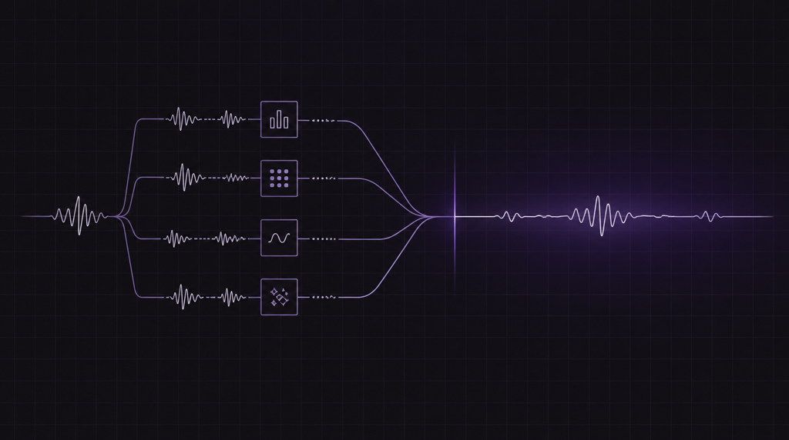

# Table of Contents

## [Announcing Orbitali’s Model Context Protocol (MCP) Server: Build Voice Agents Directly from Your IDE](2026-07-08)

Stop writing boilerplate REST calls. Now your AI coding agents can dynamically create, patch, and manage Orbitali voice agents during your development workflow.

## [Introducing Orbitali: Why We Traded the Voice AI Pipeline for a Single Real-Time Model](2026-06-30)

Most AI voice receptionists give you a "hello? ... hello?"
