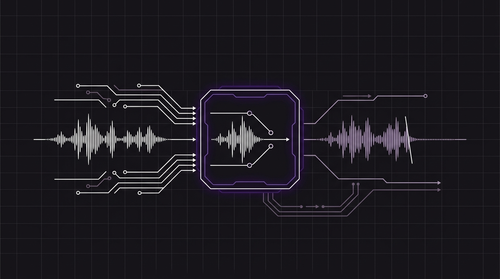
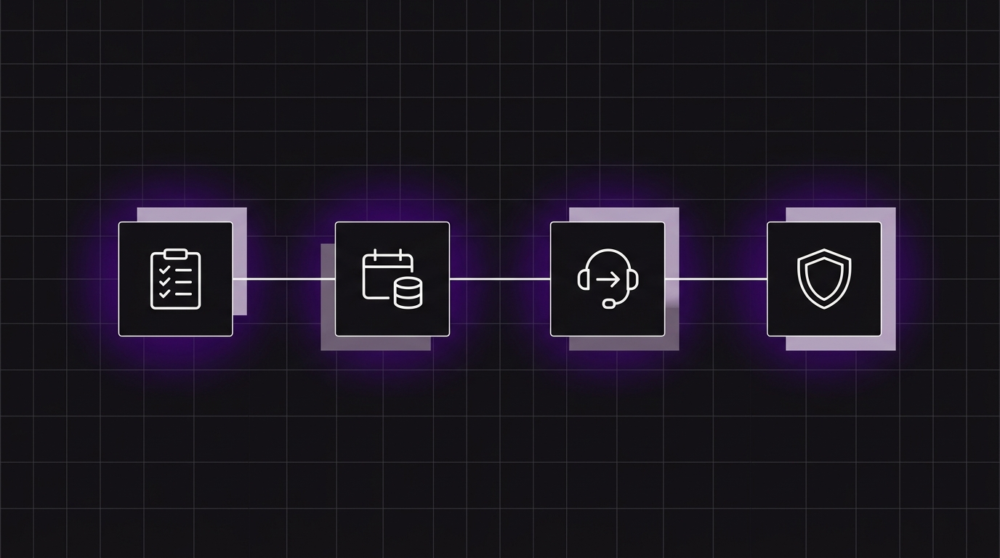

# Table of Contents

## [The BYOC Advantage: Why You Should Always Own Your Company's Phone Numbers](2026-09-18)

Many business software systems lock you into their platform by owning your business numbers or marking up your phone bill. Discover why "Bring Your Own Carrier" (BYOC) is the best practice for companies scaling voice automation with full control and zero telephony markups.

## [Dynamic Context Injection: Designing Ultra-Low Latency Voice RAG](2026-09-11)

In chat, a 1-second vector search delay is normal. In voice, a 1-second pause feels like dead air. Discover how to design voice RAG for phone receptionists within a 200ms latency budget using pre-call dynamic context injection and cached knowledge bases.

## [The Anatomy of an Interruption: How to Handle Turn-Taking in Real-Time Voice AI](2026-09-07)

The hardest part of voice AI isn't transcription accuracy or model intelligence—it's human turn-taking. Discover how full-duplex speech-to-speech architectures handle real-time interruptions, backchanneling, and conversational flow.

## [Is Your Business Ready for Voice AI? A 4-Step Qualification Checklist](2026-08-28)

Voice automation is incredibly powerful, but it isn't a magic wand. This post helps business owners determine if their current operations are ready for a voice receptionist by walking through a 4-step qualification checklist.

## [Designing Conversations: 3 Rules for Creating Voice Assistants That Customers Love to Talk To](2026-08-20)

Writing instructions for a voice agent is completely different from writing copy for a chat widget. If your voice bot speaks in long paragraphs, callers will get bored or interrupt. Learn the three key rules of voice conversation design.

## [Secure Webhooks for Voice: Shielding Your Backend from Voice Prompt Injection](2026-08-10)

As voice agents gain the power to call APIs and access databases, they become key targets for verbal prompt injection. Learn how to secure your backend by implementing input sanitization, strict type validation, and request signatures.

## [The Cost of a Missed Call: Why Voice AI is the New Front Desk](2026-08-01)

In today's hyper-convenient economy, a missed call is almost always a missed customer. Traditional automated menus lead to hung-up calls. Live receptionists are expensive and can't work 24/7. Discover how Voice AI bridges this gap, saving revenue and freeing up human staff.

## [You Own the Logic, Orbitali Runs the Agent: How to Build Secure Webhook Agents](2026-07-23)

When integrating voice AI into enterprise software, developers face a critical architectural decision: Where does the customer data live? Discover how to design voice agents that keep all customer records secure on your own backend.

## [The Zero-Friction Phone Line: Why Simplicity is the Ultimate Feature for AI Voice Agents](2026-07-15)

When building AI voice receptionists, we obsess over LLM responses, low latency, and tool orchestration. But there's a simpler hurdle that often kills momentum: getting a real phone number to ring.

## [Announcing Orbitali’s Model Context Protocol (MCP) Server: Build Voice Agents Directly from Your IDE](2026-07-04)

Stop writing boilerplate REST calls. Now your AI coding agents can dynamically create, patch, and manage Orbitali voice agents during your development workflow.

## [Introducing Orbitali: Why We Traded the Voice AI Pipeline for a Single Real-Time Model](2026-06-30)

Most AI voice receptionists give you a "hello? ... hello?"
