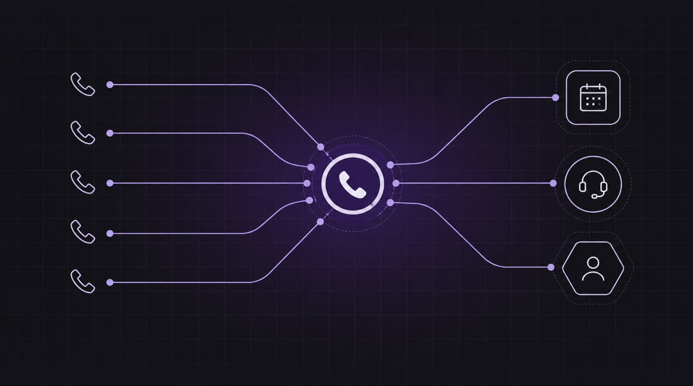
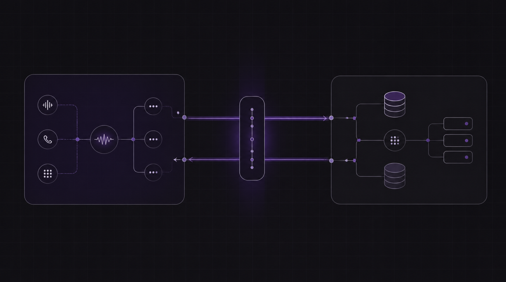

# Tabla de Contenidos

## [El coste de una llamada perdida: Por qué la IA de voz es la nueva recepción](2026-08-01)

En la economía hiperconveniente de hoy, una llamada perdida es casi siempre un cliente perdido. Los menús automatizados tradicionales causan el abandono de llamadas, y los recepcionistas en vivo son costosos y no trabajan las 24 horas. Descubre cómo la IA de voz cierra esta brecha, protegiendo tus ingresos y liberando a tu personal humano.

## [Tú controlas la lógica, Orbitali ejecuta el agente: Cómo construir agentes webhook seguros](2026-07-23)

Al integrar IA de voz en software empresarial, los desarrolladores se enfrentan a una decisión arquitectónica crítica: ¿Dónde viven los datos del cliente? Descubre cómo diseñar agentes de voz que mantengan todos los registros de los clientes seguros en tu propio backend.

## [Presentamos la Línea Telefónica Sin Fricción: Por Qué la Simplicidad es la Funcionalidad Definitiva para Agentes de Voz de IA](2026-07-15)

Al construir recepcionistas de voz de IA, nos obsesionamos con las respuestas de LLM, la baja latencia y la orquestación de herramientas. Pero hay un obstáculo más simple que a menudo frena el impulso: hacer que un número de teléfono real suene.

## [Presentamos el servidor Model Context Protocol (MCP) de Orbitali: construye agentes de voz directamente desde tu IDE](2026-07-04)

Olvídate del código boilerplate para llamadas REST. Ahora tus agentes de código de IA pueden crear, modificar y gestionar dinámicamente agentes de voz de Orbitali durante tu flujo de desarrollo.

## [Presentamos Orbitali: Por qué cambiamos el pipeline de IA de voz por un único modelo en tiempo real](2026-06-30)

La mayoría de los recepcionistas de voz de IA te dan un "¿hola? ... ¿hola?"
